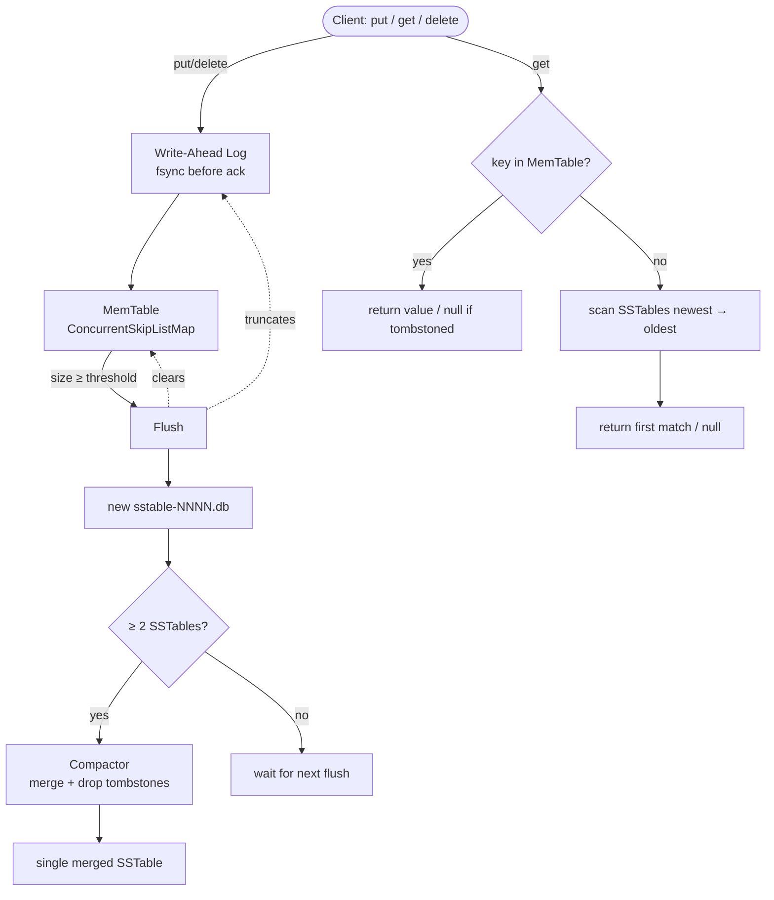

# anvil

An embedded, LSM-tree-based key-value storage engine written in Java — the kind of engine that sits *underneath* a database, not one with a query language on top. No server, no SQL: you embed it as a library and call `put(key, value)` / `get(key)` / `delete(key)` directly, the same way RocksDB or LevelDB get embedded inside larger systems.

Built in five phases, each independently verified and committed: durable writes, disk-backed storage, compaction, thread-safe concurrent access, and JMH-benchmarked performance.

**Live full-stack demo:** [anvil-a0ii.onrender.com](https://anvil-a0ii.onrender.com) — a real Spring Boot + JavaScript UI running the actual engine, not a mock.
**Architecture showcase:** [parth160905.github.io/anvil](https://parth160905.github.io/anvil/) — the diagram and benchmarks below, rendered.

## Architecture

**Write path:** every `put`/`delete` is appended to the WAL and `fsync`'d to disk before the call returns, then applied to an in-memory sorted MemTable. If the process crashes between those two steps, replaying the WAL on restart reconstructs the exact state — no acknowledged write is ever lost.

**Flush:** once the MemTable exceeds a size threshold, it's written out as an immutable, sorted SSTable file, the MemTable is reset, and the WAL is truncated.

**Compaction:** once enough SSTables accumulate, they're merged into a single file. For each key, the newest version wins; tombstoned keys are dropped entirely.

**Reads:** check the MemTable first, then scan SSTables newest-to-oldest until the key resolves or every file has been checked.

**Concurrency:** ordinary reads and writes take a shared read lock; only the flush/compaction step takes an exclusive write lock.

## Benchmarks

Measured with JMH (3 warmup + 5 measurement iterations, single fork):

| Benchmark | Throughput (ops/s) |
|---|---|
| `writeThroughput` | 893.652 ± 202.206 |
| `readFromMemtable` | 2,091.694 ± 95.638 |
| `readFromSSTable` | 88,524.118 ± 502.499 |
| `readMixed` | 4,156.447 ± 6,174.625 |

**Write throughput (~890 ops/s)** is `fsync`-bound by design: every write blocks on a disk sync before acknowledging, trading raw speed for the durability guarantee that a crash never loses an acknowledged write.

**Read throughput varies by roughly 40x depending on where a key physically lands.** This isn't noise — it's the honest cost of a linear-scan SSTable lookup, and the direct motivation for the indexing work listed below.

Also verified under concurrent load: 8 threads × 500 writes (4,000 total operations) completed in 625ms with zero errors and zero data mismatches on full readback.

## Full-stack demo (anvil-web)

The `anvil-web/` folder wraps the core engine in a Spring Boot REST API (`PUT`/`GET`/`DELETE` on `/api/kv/{key}`) with a plain HTML/CSS/JS frontend, deployed live on Render. Every button on the demo page hits real WAL/MemTable/SSTable code running server-side — it's the same engine as above, not a simulation.

Try it: [anvil-a0ii.onrender.com](https://anvil-a0ii.onrender.com) *(free-tier instance — first load after inactivity can take 30-50s to wake up)*

## Project structure
